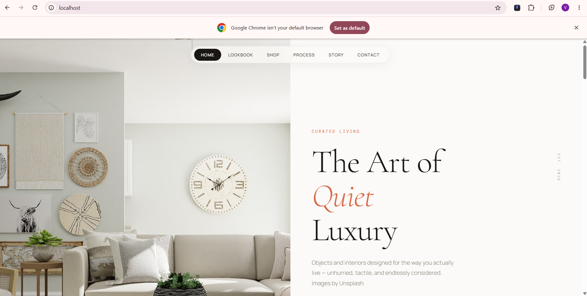
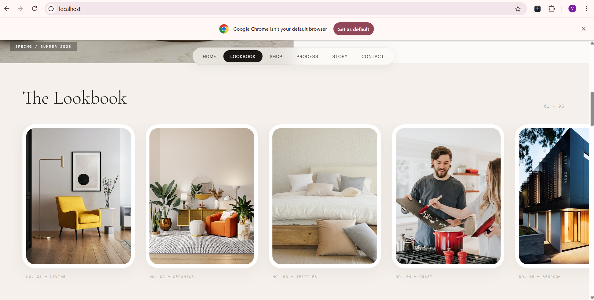
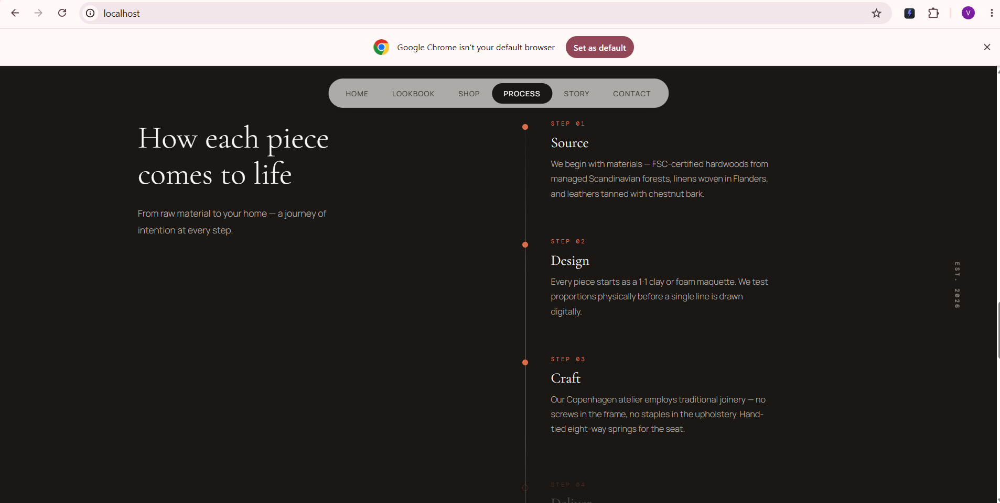

# The Ivory Flow

A static website built using a free HTML template from [Tooplate.com](https://www.tooplate.com/), customized and deployed as a personal project.

## Screenshots

## Tech Used

- HTML5
- CSS3
- JavaScript

## About This Project

This project was built to practice deploying and hosting a static website, and to serve as a portfolio piece demonstrating front-end deployment skills.

## Author

**Vinay P R**
GitHub: [@Vinay-PR-Gowda](https://github.com/Vinay-PR-Gowda)
